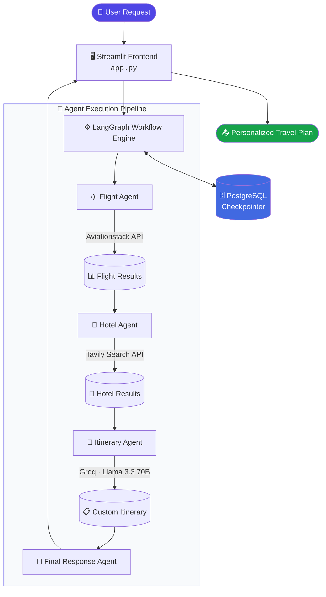

<div align="center">

# ✈️ SafarIO
### *Autonomous Multi-Agent AI Travel Planning System*

**Plan smarter. Travel better. Powered by autonomous AI agents.**

[](https://www.python.org/)
[](https://www.langchain.com/langgraph)
[](https://groq.com/)
[](https://www.postgresql.org/)
[](https://streamlit.io/)
[](#-license)
[](https://safar-io.onrender.com)

[🌐 Live Demo](https://safar-io.onrender.com) • [🚀 Quickstart](#-quickstart-guide) • [🏗️ Architecture](#️-system-architecture) • [🛠️ Tech Stack](#️-tech-stack--dependencies) • [📂 Structure](#-repository-structure)

</div>

---

## 📖 Overview

**SafarIO** is an end-to-end, production-grade **multi-agent AI framework** that automates the entire travel-planning workflow. It orchestrates a team of specialized AI agents — built on **LangGraph** — to fetch **live flight data**, perform **intelligent hotel discovery** via real-time web search, and synthesize everything into a **personalized, detailed itinerary**, all powered by **Groq's ultra-fast Llama 3.3 70B** inference and backed by **stateful PostgreSQL memory**.

> 💡 Think of it as your own AI travel agency — one that never sleeps, never forgets your preferences, and responds in milliseconds.

---

## ✨ Key Features

| Icon | Feature | Description |
|:---:|---|---|
| 🧳 | **Multi-Agent Orchestration** | Specialized agents run inside a deterministic **LangGraph** state machine, each with a single responsibility. |
| ✈️ | **Real-Time Flight Search** | Integrated with the **Aviationstack API** for live flight schedules, routes, and pricing options. |
| 🏨 | **Dynamic Web Intelligence** | **Tavily AI Search** powers context-aware hotel recommendations and local points of interest. |
| 🧠 | **Stateful Memory Persistence** | **PostgreSQL (PostgresSaver)** checkpoints conversation state and thread memory across sessions. |
| ⚡ | **Ultra-Fast LLM Inference** | **Llama 3.3 70B** on **Groq's LPU** hardware delivers near-instant itinerary generation. |
| 🎨 | **Interactive Web Dashboard** | A clean, responsive **Streamlit** UI — live and hosted on **Render**. |
| 🔐 | **Secure Configuration** | Secrets and credentials managed via `.env`, excluded from version control. |
| 💾 | **Exportable Itineraries** | Generated travel plans are archived locally under `travel_plans/`. |

---

## 🏗️ System Architecture

SafarIO follows a **deterministic, checkpointed agent pipeline** — every step of the journey (pun intended) is tracked, stateful, and recoverable.



### 🔎 Pipeline Walkthrough

1. **User Request** → submitted through the Streamlit chat interface.
2. **LangGraph Engine** → routes the request through the agent state graph.
3. **Flight Agent** → queries Aviationstack for live flight data.
4. **Hotel Agent** → performs contextual web search via Tavily for hotel options.
5. **Itinerary Agent** → uses Groq's Llama 3.3 70B to synthesize a full itinerary.
6. **Final Response Agent** → formats and returns the polished plan.
7. **PostgreSQL Checkpointer** → persists state at every node for session continuity.

---

## 🛠️ Tech Stack & Dependencies

| Layer | Technology / Tool | Purpose |
|---|---|---|
| **Frontend** | Streamlit | Interactive, real-time web interface |
| **Orchestration** | LangGraph & LangChain | StateGraph execution and node management |
| **LLM Engine** | Groq — Meta Llama 3.3 70B Versatile | High-speed reasoning and itinerary synthesis |
| **Tools & APIs** | Aviationstack API · Tavily Search API | Real-time flight tracking & hotel web search |
| **Database** | PostgreSQL & `psycopg` (v3) | Thread checkpointing & session state persistence |
| **Deployment** | Render Cloud Platform | Hosted web service and managed database |

---

## 📂 Repository Structure

```text
multi_agent_system_demo/
├── tools/
│   ├── flight_tool.py     # Aviationstack API integration
│   └── tavily_tool.py     # Tavily Web Search tool
├── travel_plans/          # Exported itinerary archives
├── .gitignore              # Excludes secrets & venv
├── app.py                  # Streamlit Web UI implementation
├── main.py                 # LangGraph state workflow & DB checkpointer
├── requirements.txt        # Production Python dependencies
└── README.md                # Project documentation
```

---

## 🚀 Quickstart Guide

### 1️⃣ Prerequisites

> ✅ Python **3.10+**
> ✅ A running **PostgreSQL** instance (local or cloud)
> ✅ API keys for **Groq**, **Tavily**, and **Aviationstack**

### 2️⃣ Clone & Set Up the Environment

```bash
git clone https://github.com/rajatDpatil/multi_agent_system_demo.git
cd multi_agent_system_demo

# Create virtual environment
python -m venv langgraph_env3

# Activate virtual environment
# Windows:
.\langgraph_env3\Scripts\Activate.ps1
# Mac/Linux:
source langgraph_env3/bin/activate

# Install dependencies
pip install -r requirements.txt
```

### 3️⃣ Configure Environment Variables

Create a `.env` file in the project root:

```env
DATABASE_URL=postgresql://<user>:<password>@<host>:5432/<dbname>
GROQ_API_KEY=your_groq_api_key
TAVILY_API_KEY=your_tavily_api_key
AVIATIONSTACK_KEY=your_aviationstack_api_key
```

### 4️⃣ Run the Application

| Mode | Command | Description |
|---|---|---|
| 💻 **CLI** | `python main.py` | Run the agent workflow from the terminal |
| 🌐 **Web Dashboard** | `streamlit run app.py` | Launch the interactive Streamlit UI |

---

## 🌐 Live Deployment

SafarIO is deployed on **Render**, running as a containerized Web Service alongside a fully managed **Render PostgreSQL** instance.

<div align="center">

### 🔗 [**safar-io.onrender.com**](https://safar-io.onrender.com)

</div>

---

## 🗺️ Roadmap

- [ ] Core multi-agent pipeline (Flight → Hotel → Itinerary)
- [ ] Weather-aware itinerary adjustments
- [ ] Currency & budget optimization agent
- [ ] Native mobile companion app
- [ ] Multi-language itinerary generation

---

## 🤝 Contributing

Contributions are welcome! To contribute:

1. Fork the repository
2. Create a feature branch (`git checkout -b feature/amazing-feature`)
3. Commit your changes (`git commit -m "Add amazing feature"`)
4. Push to the branch (`git push origin feature/amazing-feature`)
5. Open a Pull Request

---


<div align="center">

**Made with ❤️ and autonomous agents**

⭐ *If you find SafarIO useful, consider giving the repo a star!* ⭐

</div>
